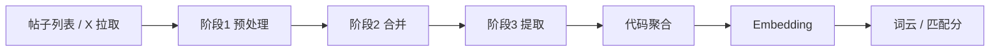

线下见面，最怕拿到的是空泛标签。「音乐 / 旅行」听起来人人都有，却开不了口。

[Roadmate](https://github.com/1nFrastr/roadmate) 要的是「周末手冲」「嵌入式 Rust」「科幻纪录片」这类见面就能聊的具体话题。而且还得说得清：这个兴趣出现得多频繁、有多新、靠哪几条帖子撑起来。

这篇文章讲兴趣推断怎么做：先用三阶段时间线抽出标签，再用代码算权重和向量，最后驱动词云和近场匹配分。

> Github 仓库

<CardGrid>
  <RepoCard repo="1nFrastr/roadmate" />
</CardGrid>

Demo：[roadmate-sooty.vercel.app](https://roadmate-sooty.vercel.app/)

## 要的不只是标签，还要归因

产品要回答三件事：

1. 这个兴趣出现得有多频繁？
2. 它有多新？
3. 哪几条帖子支撑了它？

没有归因链，就很难算时效权重，也很难评测「推断靠不靠谱」。

## 两种朴素做法，为什么不够

先后试过两种方案。

**逐帖并行提取。** 吞吐好，单帖归因也清楚。但每帖各自出标签，近义词很难合并，也缺少全局视角。

**滚动语料压缩。** 能带着先验往前推，上下文更省。可批次一合并，就很难稳定回到「是哪条帖」；新鲜度权重不可靠，中间过程也难断言。

真正需要的是：保住帖级时间，又能在全局做语义去重，还能把最终标签追回来源帖。

## 现在的做法：三段流水线，权重交给代码

当前主路径把工作拆成三段，最后由代码聚合：

```
帖子输入
  → 阶段 1 并行预处理
  → 阶段 2 时间线合并
  → 阶段 3 标签提取
  → 代码算频次 / 情感 / 新近度 / 权重
  → Embedding
  → 词云 / 设备匹配
```

| 阶段 | 模型做什么 | 代码做什么 |
| --- | --- | --- |
| 1 预处理 | 判水贴，压成短摘要 | 并发调度，过滤噪声 |
| 2 时间线合并 | 近 7 天内语义相近的帖合并 | 合并时间取最新帖 |
| 3 标签提取 | 产出破冰标签、情感、来源 | 算权重、淘汰、取 Top |

破冰规则集中在阶段 3。前两段偏工程预处理，可以单独调，不会牵一发动全身。旧方案仍保留对照，但正式路径都走这套。

## 几个关键细节

### 归因链

标签不直接绑帖子 ID 就算完。链路是：

```
标签 → 时间线条目 → 来源帖 → 发帖时间
```

频次和新近度都按真实时间算，不让模型口头估计「新不新」。

### 合并窗口

相邻 7 天内、语义高度相似的内容可以合并，用来控上下文长度。跨 7 天以上的同主题帖不合并——这样隔几周又提到咖啡，仍然算「重复出现」。

模型合并失败时，退回「一帖一条」。不会丢帖，只是去重变弱。

### 权重怎么算

同名标签先合并，再看三维：

- **频次**：来源帖数 / 总帖数
- **情感**：各来源条目情感均值
- **新近度**：按最后一次出现衰减，`exp(-λ × 距今天数)`

最终：

```
权重 = 0.40 × 频次 + 0.20 × 情感 × 新近度 + 0.40 × 新近度
```

情感再乘新近度，是为了让很久以前的情绪贡献也跟着变弱。

过滤也简单：至少出现过；只出现一次且超过 60 天就丢掉；按权重取前 20。

### 为什么每次全量重跑

每次「推断并保存」都重跑三阶段，不做增量跳过。

换来的是结果可复现，也避免滚动先验慢慢漂掉。代价是长列表会更慢一点。

### 向量和词云

只对聚合后的标签名做向量，新标签惰性生成。词云球大小是当前这一批里的相对排名，不是权重绝对值直接映射像素。

## 数据从哪进、结果往哪去



输入可以是粘贴/导入的帖子列表，也可以按 X 用户名拉原创推文。帖子原文不落进浏览器画像；画像只存标签和向量。

推断结果写入本地画像后，设备页用向量相似度和标签重叠算匹配分。设备侧不关心三阶段细节，只消费最终标签向量——「谁值得靠近」和「靠近时怎么反馈」可以分开迭代。

设备交互侧（Playground）只消费最终标签向量，不关心三阶段细节。

## 刻意不做的事

- 旧方案只作对照，不当主路径
- 不让模型直接吐最终权重；频次和时效由代码算
- 先不做增量推断，优先可复现、可评测
- 不把帖子原文持久化到浏览器画像里

## 怎么评测、怎么调

CLI 和 Web 共用同一条管线：

```bash
npm run bench:timeline
npm run bench:timeline -- --verbose
```

可以断言关键词命中、禁词、标签数量等。`--verbose` 会把每帖噪声判断、合并结果和最终权重表打出来，方便定位卡在哪一段。

常见旋钮：三维权重比例、时间衰减陡峭程度、合并窗口、输出上限、过期淘汰、并发数。

## 小结

这套推断想守住的是：

> 先保住帖级时间归因，再做全局语义去重，最后用代码算可复现的兴趣权重。

阶段 1 保吞吐和判噪，阶段 2 控重复和上下文，阶段 3 产出可破冰标签；代码负责频次、新近度和权重，再接上向量。

标签更具体、更说得清从哪来，也更容易评测，才能稳定驱动近场匹配。
