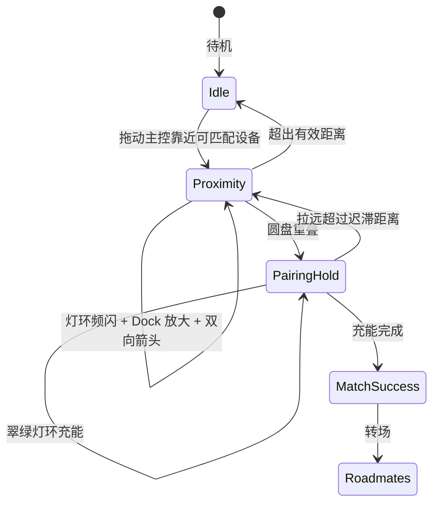

线下破冰，难的常常不是「不会说话」，而是不知道该找谁、该往哪边走。

[Roadmate](https://github.com/1nFrastr/roadmate)（路友）想验证一件事：先用 AI 筛出同频的人，再用一枚可佩戴的圆形 Tag，把「匹配」变成灯光、方向和靠近确认——尽量不掏手机。

现在还是 Web 拟物原型：拖动主控靠近同频设备，看灯环怎么闪、箭头往哪指、两机重叠后如何充能配对。这篇文章只讲设备外形和近场反馈是怎么定下来的。

> Github 仓库

<CardGrid>
  <RepoCard repo="1nFrastr/roadmate" />
</CardGrid>

Demo：[roadmate-sooty.vercel.app](https://roadmate-sooty.vercel.app/)

## 用户其实只关心两件事

不掏手机的前提下：

1. 附近有没有人和我聊得来？
2. 如果有，往哪边走？

所以原型要同时验证两件事：外形看起来像不像一枚真硬件，反馈清不清楚。

## 最早做成卡片，为什么不够用

第一版很像竖向 iPod：顶部一颗状态灯，底部还有假滚轮。

「有匹配」能演示出来，但多人一起出现时就露怯了：

- 单点灯像普通指示灯，远一点看不清，侧面更容易漏看
- 假滚轮没有交互，却占掉结构和屏幕
- 屏外再放一个确认按钮，更像 App，不像「无实体键、靠靠近确认」的硬件

我们需要的是：任意角度都像信标；整套反馈只靠距离推进，而不是靠点按钮。

## 现在的答案：圆形 Tag

当前形态很简单：

- 正圆金属壳
- 中间圆形墨水屏
- 屏外一圈灯带
- 没有物理按键

主控设备 RM-01 多一圈青色外环，方便在画布上认出「这是我」。

交互只守四条：

1. **距离即信号**：拖动主控就驱动反馈，不靠点击
2. **灯环管余光，圆屏管精确信息**
3. **一步一步来**：远 → 近 → 重叠 → 充能 → 成功
4. **像真硬件**：确认方式对齐 NFC 靠近，不装假按键

还有一层边界：Interest Lab 负责「谁值得靠近」，Playground 负责「靠近时怎么反馈」。匹配分从 Lab 来，设备侧不再重算兴趣语义。

## 外形怎么收敛到圆形信标

| 阶段 | 形态 | 灯光 | 按键 |
| --- | --- | --- | --- |
| v1 | iPod 竖向卡片 | 顶部单点 LED | 底部滚轮装饰 |
| v2 | 去掉滚轮的卡片 | 仍是单点 LED | 无 |
| v3（当前） | AirTag 式正圆 | 360° 环形灯带 | 无；重叠后灯环充能 |

卡牌体积感和 Matter 叠放感留了下来，没交互的滚轮去掉了。引入环形灯带，是为了在人群里一眼像信标。

## 靠近时发生什么

**灯环。** 拖动主控时，只有最近一对可匹配设备会琥珀色频闪。有效距离大约是设备直径的三倍：越近，闪得越快、光晕越强。

实现上用持久动画调速，而不是每帧销毁重建——否则频率没法跟着距离连续变化。

**箭头。** 灯环说「有多强」，箭头说「往哪边」。进入有效距离后，圆屏显示指向对方的旋转箭头；待机时显示品牌字，箭头出现就让位。配对成功后，箭头换成匹配分和共同话题。

**碰一碰。** 两机圆盘重叠后：

1. 灯环切到翠绿
2. 保持约 1 秒，进度沿灯环充填
3. 完成就成功转场；拉远超过迟滞距离则取消

中间试过屏外长按按钮，后来删了。用户只需要「拿着靠近」，才和量产 NFC 确认一致。

**Dock 放大。** 主控靠近到一定范围，目标设备会略放大，和灯环一起形成「被吸引」的感觉。

## 状态怎么走



颜色也有固定语义：琥珀是近场寻缘，翠绿是配对充能。

## 刻意不做的事

- 不做假实体键，确认只保留靠近和重叠
- 不让所有接近对象同时闪灯——多人场景宁可漏闪，也不要噪声盖过信号
- 不在设备页重算兴趣语义，匹配分继续来自 Lab

整条链路是：

```
Interest Lab 画像
      │
      ▼
匹配分（向量相似度 + 标签重叠）
      │
      ▼
Playground 近场反馈与配对
      │
      ▼
Roadmates 轻社交原型
```

兴趣侧细节见 [怎么从发帖里抽出见面就能聊的标签](/article/8710aee9/)。

## 下一步

原型里已经跑通：环形灯距离频闪、圆屏箭头、重叠充能、物理叠放、匹配分展示。

更贴近硬件时，会补真实 LED 与功耗、圆形墨水屏刷新、NFC 确认，以及物理碰撞触发配对。

## 小结

这套设备设计想说清楚的是：

> 把抽象匹配变成可感知的近场信号，同时让外形和确认方式对齐无键 NFC 硬件。

正圆加环形灯带解决视认性；灯环管强度，箭头管方向，重叠充能管确认；一次只服务最近一对，控制噪声；语义匹配和近场反馈拆开，方便各自迭代。

拖动主控，就能走完「发现 → 靠近 → 配对」。
